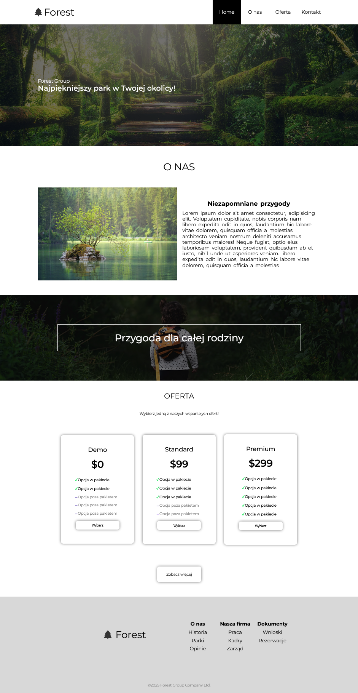

# Projekt końcowy kursu HTML, CSS i JavaScript

Ten projekt był zadaniem końcowym mojego kursu z zakresu HTML, CSS i JavaScript. Zadanie polegało na stworzeniu strony internetowej na podstawie dostarczonego szablonu. Celem było jak najwierniejsze odwzorowanie wyglądu i funkcjonalności.

## Szczegóły projektu:
- **Technologie użyte**: HTML, CSS, JavaScript (opcjonalnie inne narzędzia, np. SASS, npm itp.)
- **Wymagania**: Stworzenie responsywnej strony zgodnej z dostarczonym szablonem.

## Ważne informacje
Ten projekt powstał w ramach kursu i służy wyłącznie celom edukacyjnym. Szablon nie jest mojego autorstwa i nie może być używany do celów komercyjnych.

## Porównanie z oryginalnym szablonem

Oto jak moja implementacja wygląda w porównaniu do oryginalnego szablonu:

| Oryginalny szablon | Moja implementacja |
|--------------------|--------------------|
|  |  |

## Wprowadzone Usprawnienia

Oprócz wiernego odwzorowania szablonu, wprowadziłem następujące usprawnienia:
- **Animacje CSS**: Dodałem płynne przejścia (transitions) i animacje dla elementów interaktywnych, takich jak przyciski i menu nawigacyjne.
- **Walidacja formularza**: Zaimplementowałem walidację danych wejściowych w formularzu za pomocą JavaScript, aby zapewnić lepsze doświadczenie użytkownika.
- **Optymalizacja responsywności**: Dopracowałem media queries, aby strona działała jeszcze lepiej na mniejszych ekranach, takich jak smartfony.
- **Czysty kod**: Zorganizowałem kod w moduły (np. osobne pliki CSS i JavaScript), aby był łatwiejszy do utrzymania.

## Planowane Usprawnienia

Chociaż projekt spełnia wymagania kursu, planuję go dalej rozwijać. Oto kilka pomysłów na przyszłość:
- **Implementacja backendu**: Dodanie prostego backendu w Node.js lub Express, aby umożliwić obsługę formularzy lub logowanie użytkowników.
- **Dynamiczne elementy**: Użycie frameworka JavaScript, takiego jak React lub Vue, aby uczynić stronę bardziej interaktywną.
- **Optymalizacja SEO**: Dodanie meta tagów, mikroformatów i innych technik poprawiających widoczność strony w wyszukiwarkach.
- **Dostępność (Accessibility)**: Poprawa dostępności strony zgodnie z wytycznymi WCAG, aby była przyjazna dla osób korzystających z technologii wspomagających.

## Licencja
Ten projekt służy wyłącznie celom edukacyjnym. Szablon nie jest mojego autorstwa i nie może być używany do celów komercyjnych.